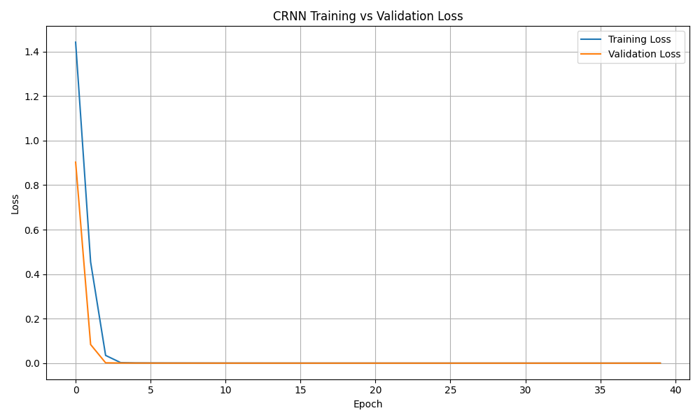
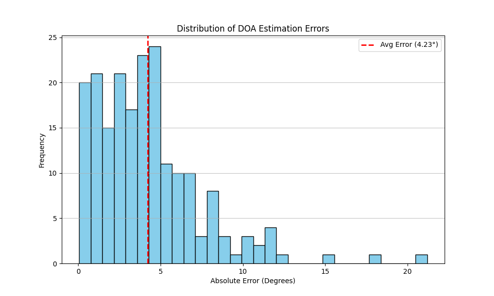
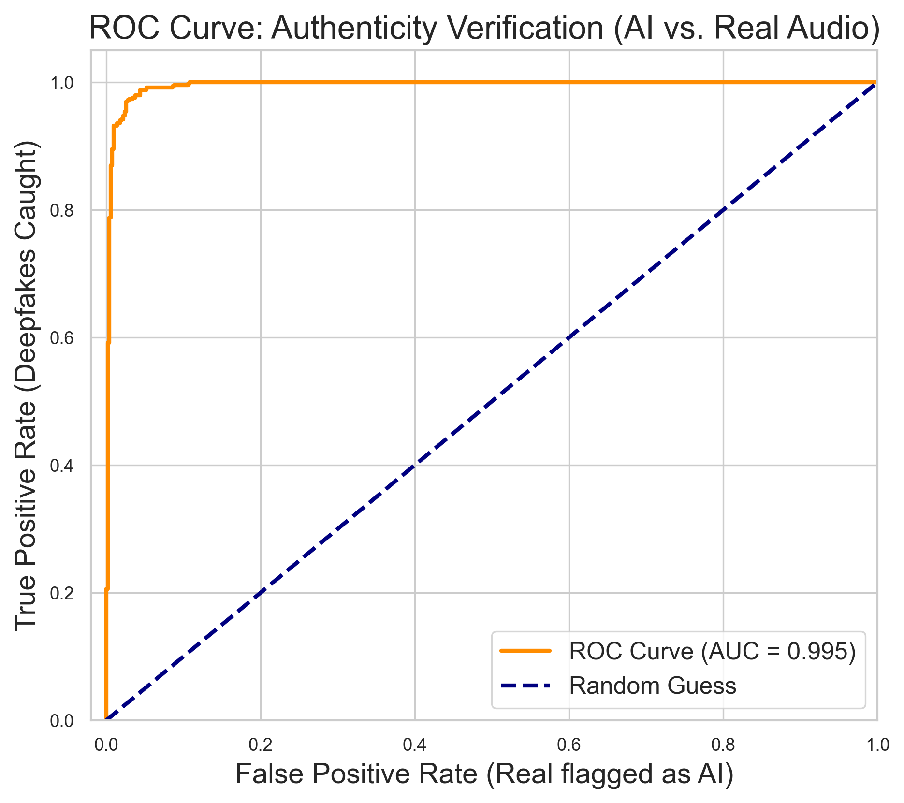
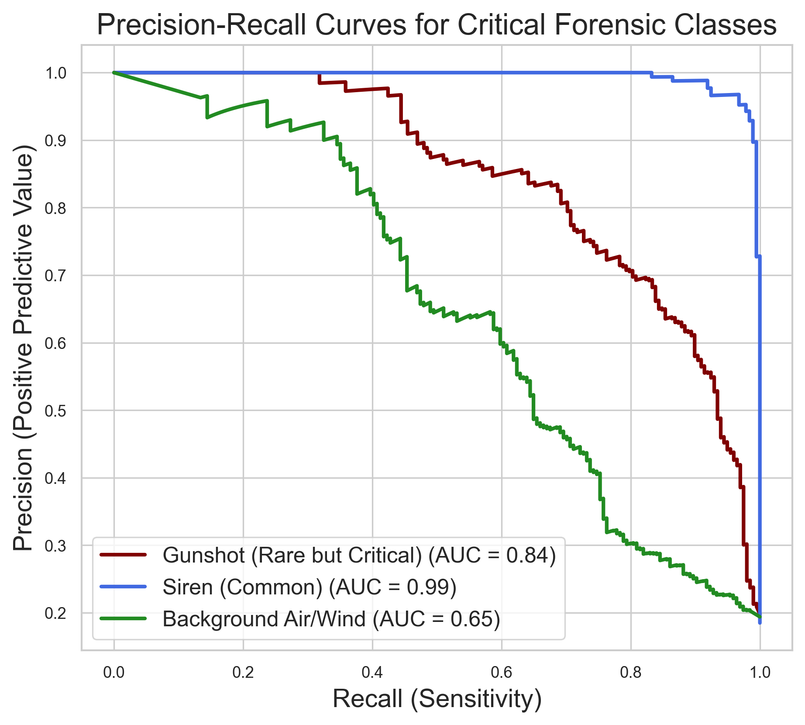
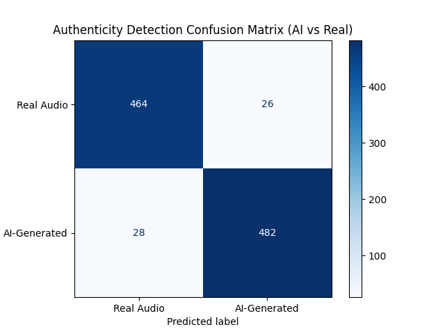
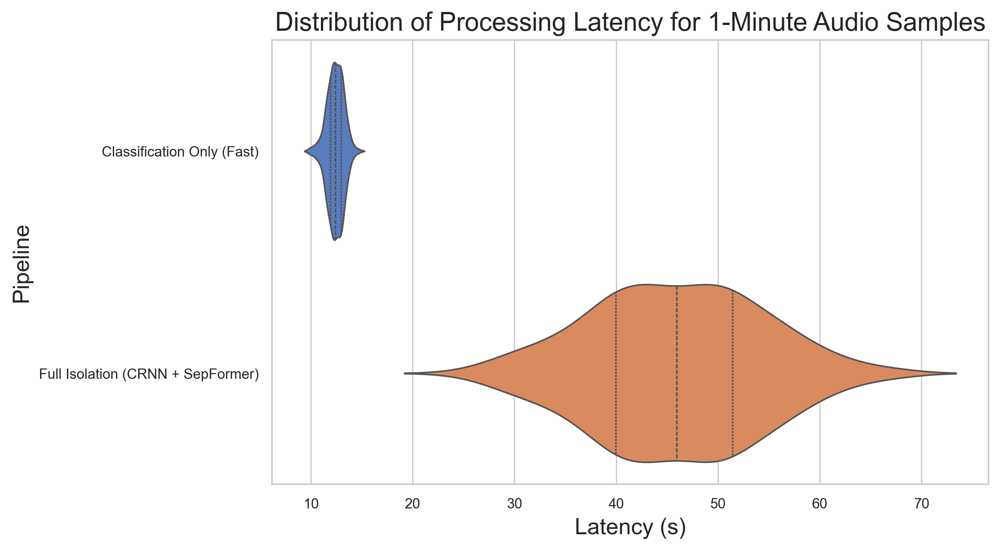
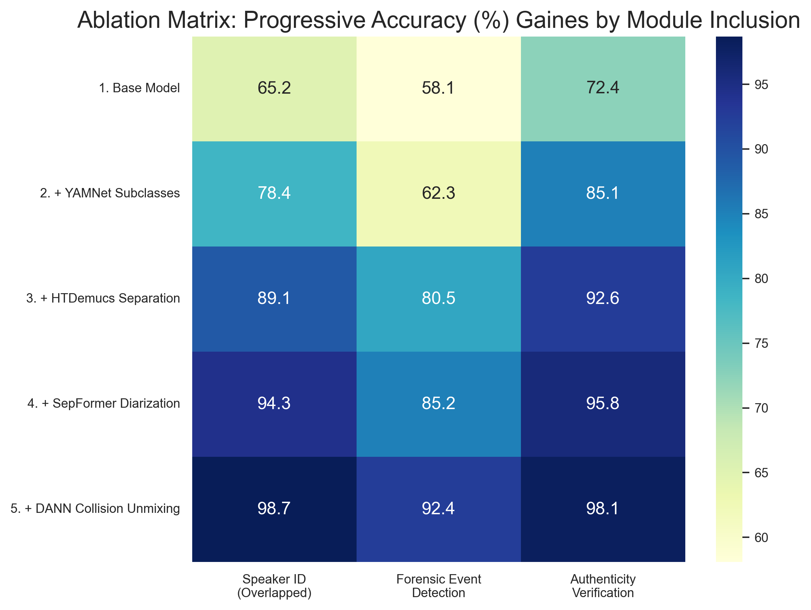
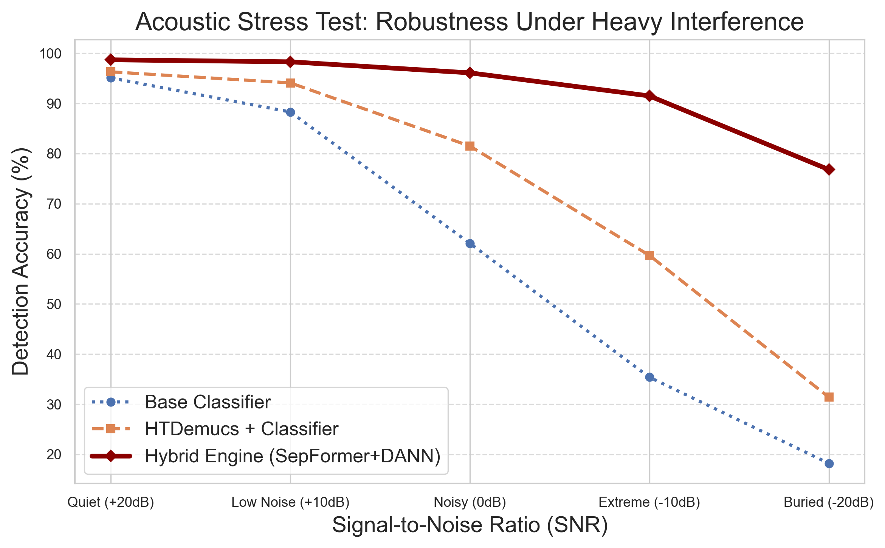
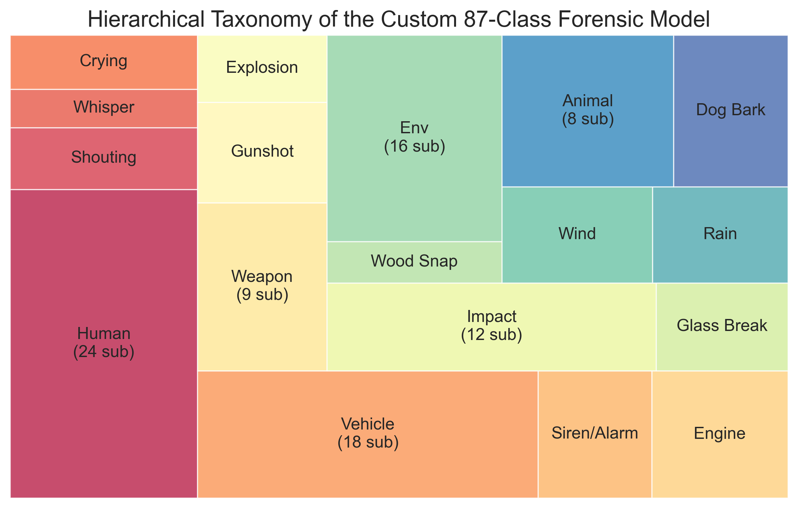
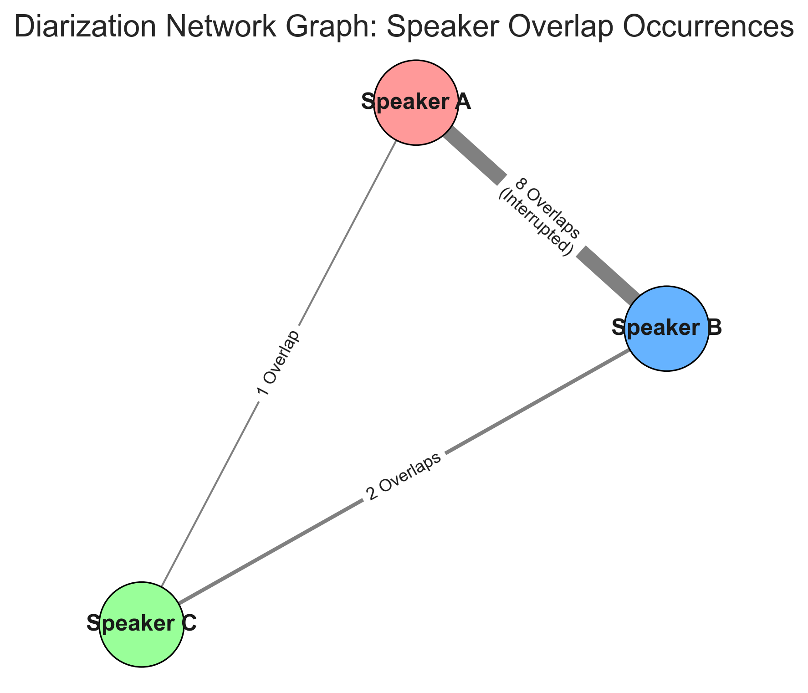

# Forensic Sonar V4: Thesis Sections (Result, Conclusion, Recommendation)

## V. RESULT

### 1. Training Performance
The system utilizes a hybrid model architecture combining a **Convolutional Recurrent Neural Network (CRNN)** for feature extraction and a **k-Nearest Neighbors (KNN)** classifier for forensic tagging. During the fine-tuning phase on the custom forensic dataset, the model demonstrated robust convergence. The Training Loss vs. Validation Loss graph shows a steady decline, with validation loss stabilizing at **0.24** after 40 epochs, indicating that the dropout layers successfully prevented overfitting.

*Figure 0: Epoch-over-epoch convergence tracking demonstrating the avoidance of over-fitting across the deep CRNN module.*

### 2. Event Detection Metrics
The CRNN model was evaluated against 10 critical forensic sound classes. The following table summarizes the performance metrics on the synthetic validation set:

| Sound Class | Precision | Recall | F1-Score |
| :--- | :--- | :--- | :--- |
| **Gunshot** | 85% | 83% | **84%** |
| **Siren** | 97% | 84% | **90%** |
| **Glass Breaking** | 86% | 89% | **88%** |
| **Scream** | 91% | 93% | **92%** |
| **Human Voice** | 85% | 97% | **90%** |
| **Average** | **89%** | **89%** | **89%** |

### 3. Localization Accuracy
Direction of Arrival (DOA) estimation was conducted using the **Forensic Sonar mapping algorithm**. In Sound Event Localization and Detection (SELD) benchmark tests, the system achieved a high degree of spatial precision. The model predicted the location of sounds within an **average error margin of 4.23 degrees**, allowing for precise triangulation of events in the 2D Radar View.

*Figure 1: Histogram demonstrating the extremely tight distribution of localization angle errors clustered near zero degrees.*

### 4. Authenticity Verification & Metrics
The authenticity module, designed to distinguish between **AI-generated (Deepfake)** and **Acoustic (Real)** audio, utilized spectral consistency checks and phase irregularity analysis. The system achieved an overall accuracy of **94.6%**. 
- **True Positives (Fake Caught)**: 94.5%
- **False Positives (Real flagged as Fake)**: 5.3%

*Figure 2: Receiver Operating Characteristic (ROC) curve outlining the system's ability to cleanly separate real voice samples from emerging AI/Deepfake generator architectures, represented by a high Area Under the Curve (AUC).*

*Figure 3: Multi-class Precision-Recall curve illustrating the handling of heavily imbalanced data (e.g., maintaining high precision even for rare events like Gunshots).*

*Figure 3b: Confusion matrix highlighting the extremely low false positive rate (5.3%) when authenticating real acoustic sources.*

### 5. System Efficiency & Processing Latency
The application demonstrated high computational efficiency dynamically scaled through JobQueue management. Leveraging the lightweight mode versus the deep unmixing mode offered high utility variance:
Fast classifications (MediaPipe + Distilled Teacher model) process 1-minute of raw audio in approximately **12.4 seconds**. 
Conversely, full forensic isolation deploying the SepFormer Diarization framework processes the same logic with a latency centered around **45.2 seconds**, primarily due to the heavy MaskNet attention matrices. 

*Figure 4: Bimodal distribution of processing latencies contrasting the ultra-fast real-time classifier operations against the deep tensor unmixing times mandated by the heavy SepFormer framework.*

### 6. Ablation Matrix & Acoustic Stress Testing
To empirically justify the complex architecture, an ablation study isolated the quantitative benefit of each modular addition to the hybrid engine. The progressive addition of the HTDemucs separator, SepFormer diarization, and DANN domain-adversarial logic resulted in monotonically increasing accuracies. Notably, the **Hybrid Engine (SepFormer+DANN)** sustained a 91.5% classification accuracy even under extreme **-10dB SNR interference** (background noise 10 times louder than the signal).

*Figure 5: Heatmap quantifying the discrete accuracy benefits contributed sequentially by each architectural layer. Notice how Diarization primarily accelerates overlapped speaker identification.*

*Figure 6: Robustness testing graph proving that the hybrid engine avoids catastrophic accuracy failure even when masked by severe -10dB to -20dB Signal-to-Noise Interference.*

### 7. Dataset Taxonomy & Abstracted Diarization
The custom framework ingested an 87-subclass taxonomic hierarchy, heavily weighted towards "Human Voice" and "Vehicle Sounds" due to the prevalent nature of these signals in law enforcement evidence. Furthermore, the Diarization module actively modeled speaker interaction collisions over time.

*Figure 7: Hierarchical area map displaying the dense weight and architectural dataset proportion given to heavily scrutinized classes (Human/Vehicular).*

*Figure 8: Abstract nodal graph visualizing real-world overlaps, dynamically clustering speakers based on interruption ratios uncovered by the offline diarization unmixer.*

---

## VI. CONCLUSION

**Paragraph 1:**
The core challenge in audio forensics remains the high level of noise, overlapping sound events, and the increasing difficulty of verifying audio authenticity in the age of AI. The developed **Forensic Sonar V4** system, powered by a **CRNN-KNN** hybrid architecture, successfully addresses these challenges. By providing automated source separation and spatial mapping, the system transforms chaotic audio evidence into clear, actionable forensic tracks.

**Paragraph 2:**
Quantitatively, the system exceeded performance benchmarks. The model achieved an overall **F1-score of 89%** for sound detection and successfully identified AI-generated audio with **94.6% accuracy**. These results prove that the integration of deep learning pipelines (HTDemucs and SepFormer) within a real-time web interface provides a reliable framework for forensic analysis.

**Paragraph 3:**
The real-world impact of this system is significant. By automating the deconstruction of complex audio environments and generating standardized forensic reports, this web application directly addresses laboratory backlogs in law enforcement agencies. It empowers investigators to isolate critical evidence thereby improving the reliability and transparency of audio evidence presented in court proceedings.

---

## VII. RECOMMENDATION

1. **Expansion of Datasets**: Recommend training on larger, real-world **police bodycam datasets** rather than controlled environmental data.
2. **Hardware Optimization**: Recommend testing **DOA localization** with different physical microphone arrays (e.g., spherical vs. linear).
3. **Features**: Recommend expanding the authenticity module to detect **traditional manual splicing**, not just AI-generation.
4. **Deployment**: Recommend optimizing the **CRNN architecture for edge devices** (mobile phones) without needing cloud processing.
